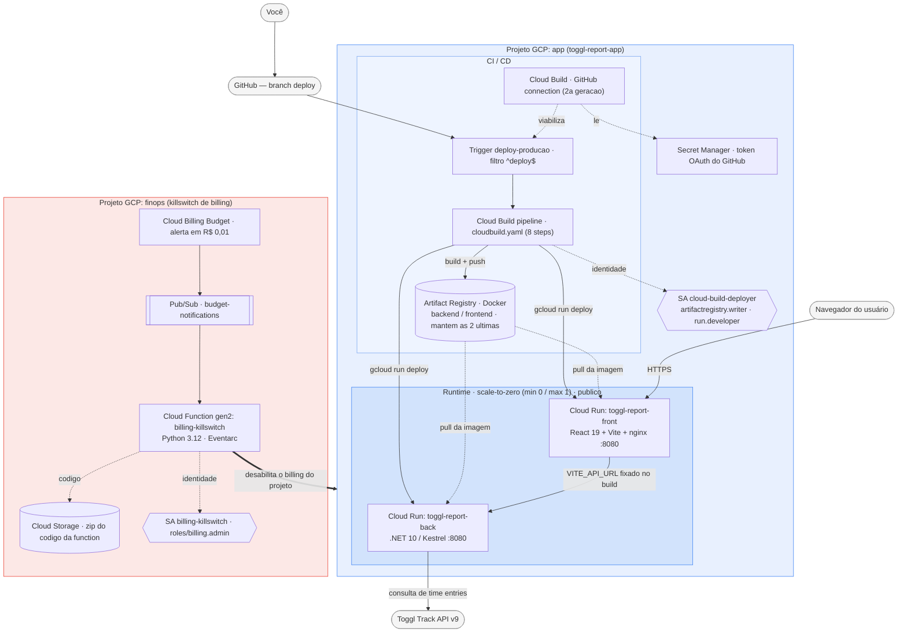

# toggl-report-infra

Infraestrutura de deploy do `toggl-report` no GCP, com premissa de **custo
zero**: Cloud Run (frontend + backend) + Cloud Build (CI/CD) + Artifact
Registry, sem banco de dados, sem ambiente de homologação — só a branch
`deploy` disparando produção.

## Arquitetura da stack



### O que roda, como e por quê

**Projeto `app` — a aplicação e sua pipeline**

| Componente | Tecnologia | Como está sendo usado | Por quê |
|---|---|---|---|
| **Cloud Run — backend** | .NET 10 / Kestrel, container `:8080` | Serve a Web API (`toggl-report-back`); `min_instance_count=0`, `max_instance_count=1`, público (`allUsers`) | Escala a zero sem tráfego = custo zero na operação normal; teto de 1 instância evita surpresa de conta. Sem auth na infra porque a proteção é opcional no próprio app (HTTP Basic via env var) |
| **Cloud Run — frontend** | React 19 + Vite, servido por nginx, container `:8080` | Serve a SPA (`toggl-report-front`); mesma config de escala e acesso público | SPA estática consumida direto pelo navegador do usuário; a URL do backend (`VITE_API_URL`) é gravada no bundle em *build time*, não em runtime |
| **Artifact Registry** | Repositório Docker (`toggl-report`) | Guarda as imagens `backend:<sha>` e `frontend:<sha>` de cada deploy; Cloud Run puxa a imagem de lá | Duas *cleanup policies* (KEEP + DELETE) mantêm só as 2 versões mais recentes de cada serviço → storage mínimo |
| **Cloud Build — trigger** | `deploy-producao`, regex de branch `^deploy$` | Dispara o pipeline a cada `git push` na branch `deploy` | Não há ambiente de homologação: a branch `deploy` **é** a produção |
| **Cloud Build — pipeline** | `cloudbuild.yaml`, 8 steps | test (`dotnet build` / `npm ci && build && lint`) → build das 2 imagens Docker → push → `gcloud run deploy` dos 2 serviços → health check | `dotnet build`/`tsc` são o "teste" possível (o projeto não tem suíte automatizada); o health check falha o build se algum serviço não responder 2xx pós-deploy |
| **Cloud Build — GitHub connection** | Conexão de 2ª geração, por região | Liga o repositório GitHub ao Cloud Build; o token OAuth fica no Secret Manager | É o mecanismo atual (o GitHub App clássico saiu do Console); criada **manualmente** (OAuth interativo) e adotada no state via `terraform import` |
| **Secret Manager** | — | Armazena o token OAuth da conexão GitHub | Exigência da conexão de 2ª geração; a API é habilitada pelo Terraform mas o segredo em si não é gerenciado por ele |
| **Service Account `cloud-build-deployer`** | IAM Service Account | Identidade do trigger: `artifactregistry.writer` + `run.developer` + `logging.logWriter` + `serviceAccountUser` sobre a SA default do Compute | Menor privilégio para build + push + deploy; `logWriter` é **obrigatório** quando o trigger usa SA customizada |
| **SA default do Compute Engine** | IAM Service Account | Identidade de *runtime* dos 2 serviços Cloud Run | Evita criar 2 SAs extras não pedidas; o deployer só precisa poder "agir como" ela para fazer `gcloud run deploy` |

**Projeto `finops` — o killswitch de orçamento (isolado de propósito, ver seção abaixo)**

| Componente | Tecnologia | Como está sendo usado | Por quê |
|---|---|---|---|
| **Cloud Billing Budget** | Orçamento (criado via `gcloud`, fora do Terraform) | Alerta configurado em `R$ 0,01` / `1%` → publica no tópico Pub/Sub | "Avise no primeiro centavo de gasto"; a criação do Budget depende de recursos que só existem após o `apply` e não entrou no escopo de automação |
| **Pub/Sub `budget-notifications`** | Tópico | Único canal entre o Budget e a Function | É o padrão oficial do Google para *"disable billing with notifications"* |
| **Cloud Function `billing-killswitch`** | Python 3.12, gen2, gatilho Eventarc | **Qualquer** mensagem no tópico → desabilita o billing do projeto `app` (`billing_account_name=""`) | Não inspeciona o conteúdo da mensagem (o tópico só recebe alerta desse budget); transforma "conta subindo" em "projeto suspenso" antes de virar fatura alta |
| **Cloud Storage (bucket de source)** | Bucket dedicado | Guarda o `.zip` do código da Function (empacotado pelo provider `archive`) | `google_cloudfunctions2_function` exige `storage_source` em GCS — não aceita código inline nem Git |
| **Eventarc** | — | Entrega as mensagens Pub/Sub → Function gen2 | Obrigatório para *event trigger* de Function gen2 com SA customizada |
| **Service Account `billing-killswitch`** | IAM Service Account | `roles/billing.admin` concedido **na billing account** (não no projeto) | Permissão mínima para desligar o billing de outro projeto; a Cloud Billing API valida esse papel no nível da billing account |

**Transversal aos dois**

| Componente | Tecnologia | Como está sendo usado | Por quê |
|---|---|---|---|
| **Terraform** | `>= 1.9`, provider `google` (+ `archive` no `finops`) | Duas árvores independentes (`terraform/app/`, `terraform/finops/`), cada uma com seu state | State **local** e gitignored: projeto pessoal, sem colaboração em equipe → não compensa provisionar um bucket GCS só para o state |
| **Dois projetos GCP separados** | — | `finops` provisiona o mecanismo que protege `app` | Se `app` for suspenso por estouro de orçamento, tudo dentro dele para junto — o killswitch precisa viver **fora** para sobreviver à própria ação e permitir religar/diagnosticar |
| **GitHub (`glerystonmatos/toggl-report`)** | Repositório | Fonte do código; push na branch `deploy` dispara o build | Deploy baseado em Git, sem console/upload manual |
| **Toggl Track API v9** | API externa | Consumida pelo backend **em runtime** para buscar os *time entries* | É a fonte de dados da aplicação; nada é persistido na infra (sem banco) |

> Legenda do diagrama: caixa azul = projeto `app`, caixa vermelha = projeto `finops`. Setas tracejadas = dependência de configuração/identidade; seta grossa = ação do killswitch (desliga o billing do projeto inteiro).

## Duas árvores Terraform, dois projetos GCP, de propósito

```
terraform/
 ├─ finops/   # projeto GCP dedicado só à proteção de billing (killswitch)
 └─ app/      # projeto GCP principal: Cloud Run, Cloud Build, Artifact Registry
```

**Por quê separados**: o mecanismo que protege o orçamento (Pub/Sub + Cloud
Function + Service Account com permissão de administrar billing) não pode
viver no mesmo projeto que ele protege — se o projeto de app for suspenso por
estouro de orçamento (billing desabilitado), tudo dentro dele para junto,
inclusive o killswitch que deveria continuar funcionando. Isolar em dois
projetos GCP garante que o killswitch sobrevive à própria ação que ele
executa.

## Estado do Terraform

Local (`terraform.tfstate`, gitignored) nas duas árvores — projeto pessoal,
sem necessidade de colaboração em equipe; evita provisionar um bucket GCS só
para isso.

## Como o custo fica em zero, na prática

Duas coisas diferentes, não confundir:
- **Cloud Run `min_instance_count=0`/`max_instance_count=1`** (`terraform/app/cloud-run.tf`)
  é o que mantém o custo em zero **na operação normal** — sem tráfego, zero
  instâncias rodando, zero cobrança (dentro do free tier — confirmar limites
  atuais na documentação oficial, não assumidos aqui).
- **O killswitch** (`terraform/finops`) é a rede de segurança para o
  **anormal** — um pico de tráfego, um bug, uma chave vazada sendo abusada.
  Ele não impede que ALGUM custo aconteça antes de agir (ver limitação
  abaixo); ele existe para não deixar um problema virar uma conta alta.

---

## Ordem de execução

### 0. Instalar e validar o Terraform

```powershell
winget install HashiCorp.Terraform
terraform -version
```
Instala o Terraform (`required_version >= 1.9.0` nas duas árvores) via
gerenciador de pacotes do Windows.

```powershell
cd toggl-report-infra\terraform\<finops|app>
terraform init -backend=false
terraform validate
```
Validação estática de sintaxe, sem precisar de projeto/credenciais reais
ainda — rode nas duas árvores (`finops` e `app`).

### 1. Criar os dois projetos GCP e vincular o billing (manual)

Escolha os IDs dos dois projetos (únicos globalmente no GCP) — usados como
placeholder no resto deste README e nos `terraform.tfvars.example`:
`SEU_PROJETO_FINOPS_ID` e `SEU_PROJETO_APP_ID`. Troque pelos IDs reais que
você escolher em todos os comandos abaixo.

```bash
gcloud projects create SEU_PROJETO_FINOPS_ID --name="SEU_PROJETO_FINOPS_ID"
```

```bash
gcloud projects create SEU_PROJETO_APP_ID --name="SEU_PROJETO_APP_ID"
```
Cria os dois projetos. O Terraform não faz isso (nenhum `google_project` foi
declarado) — os projetos são um pré-requisito, não um recurso gerenciado
aqui.

```bash
gcloud billing projects link SEU_PROJETO_FINOPS_ID --billing-account=SEU_BILLING_ACCOUNT_ID
```

```bash
gcloud billing projects link SEU_PROJETO_APP_ID --billing-account=SEU_BILLING_ACCOUNT_ID
```
Vincula a mesma conta de faturamento aos dois projetos — sem isso, nenhuma
API paga (mesmo as gratuitas até um limite) pode ser habilitada. **Confirme
que rodou isso também** — criar o projeto não vincula billing sozinho.

### 2. Instalar o Google Cloud CLI e autenticar

```powershell
winget install Google.CloudSDK
```
Instala o `gcloud` via gerenciador de pacotes do Windows. Feche e reabra o
terminal (ou recarregue o `PATH` na sessão atual) depois de instalar, senão
o comando não é encontrado.

```powershell
(New-Object Net.WebClient).DownloadFile("https://dl.google.com/dl/cloudsdk/channels/rapid/GoogleCloudSDKInstaller.exe", "$env:TEMP\GoogleCloudSDKInstaller.exe")
& "$env:TEMP\GoogleCloudSDKInstaller.exe"
```
Alternativa se o `winget` falhar — instalador gráfico oficial da Google, que
já configura o `PATH` sozinho.

```bash
gcloud --version
```
Confirma que a instalação funcionou.

```bash
gcloud init
```
Assistente interativo: abre o navegador para login e pergunta se quer fixar
um projeto/região padrão — pode pular a escolha de projeto padrão, já que
você alterna entre `SEU_PROJETO_FINOPS_ID` e `SEU_PROJETO_APP_ID` conforme a
árvore Terraform. Esse comando já cobre o login do CLI; os dois comandos
abaixo continuam necessários porque autenticam contextos diferentes.

```bash
gcloud auth login
```
Autentica o `gcloud` CLI (usado nos comandos manuais deste README — criar
projetos, budgets, consultar recursos). Redundante com o login feito dentro
do `gcloud init` acima, mas sem custo rodar de novo se precisar trocar de
conta.

```bash
gcloud auth application-default login
```
Autentica separadamente as *Application Default Credentials*, que é o que o
provider `google` do Terraform usa. Os dois logins são independentes.

### 3. Aplicar o killswitch (`terraform/finops`)

```bash
cd toggl-report-infra/terraform/finops
```
Entra na árvore Terraform do projeto finops — todo comando `terraform`
seguinte roda a partir daqui (cada árvore tem seu próprio state, então rodar
no diretório errado aplicaria os recursos errados).

```bash
cp terraform.tfvars.example terraform.tfvars
```
Copia o template para `terraform.tfvars` — o Terraform lê esse arquivo
automaticamente (sem precisar passar `-var-file`) e ele já está no
`.gitignore`, então preencher com valores reais aqui não versiona nada.
Depois de copiar, edite `terraform.tfvars` e preencha 3 valores:

- **`finops_project_id`** — o ID do projeto finops. É literalmente o que
  você usou em `gcloud projects create SEU_PROJETO_FINOPS_ID ...` (passo 1).
  Para confirmar: `gcloud projects list --filter="name:SEU_PROJETO_FINOPS_ID"`
  ou Console GCP → seletor de projeto no topo da tela (mostra o ID, não só
  o nome de exibição — os dois podem ser diferentes se o ID pedido já
  estava em uso e o GCP sugeriu um com sufixo).
- **`app_project_id`** — mesma lógica, para `SEU_PROJETO_APP_ID`:
  `gcloud projects list --filter="name:SEU_PROJETO_APP_ID"`.
- **`billing_account_id`** — não vem da criação dos projetos, vem da conta
  de faturamento em si: `gcloud billing accounts list` (coluna
  `ACCOUNT_ID`, formato `XXXXXX-XXXXXX-XXXXXX`) ou Console GCP → Faturamento
  → Gerenciar contas de faturamento.

```bash
terraform init
```
Baixa os plugins dos providers declarados em `versions.tf` (`google` e
`archive`) e prepara o diretório de trabalho local — precisa rodar pelo
menos uma vez por árvore, e de novo sempre que `versions.tf` mudar.

```bash
terraform plan
```
Calcula e mostra **o que seria criado/alterado/destruído** comparando o
código com o estado atual — **não aplica nada**. É o momento de revisar:
confira se a lista bate com o esperado (bucket, tópico Pub/Sub, service
account, 3 bindings de IAM, a Cloud Run Function) antes de prosseguir.

```bash
terraform apply
```
Executa de fato o que o `plan` mostrou — pede confirmação (`yes`) antes de
criar os recursos reais no GCP. É o único dos três comandos que provisiona
algo de verdade na nuvem (`init`/`plan` nunca criam, alteram ou apagam
nada); os recursos criados aqui normalmente ficam dentro do free tier
(custo esperado R$ 0), mas são recursos reais, não uma simulação.

```bash
gcloud billing budgets create \
  --billing-account=SEU_BILLING_ACCOUNT_ID \
  --display-name="SEU_PROJETO_APP_ID-killswitch" \
  --budget-amount=0.01BRL \
  --threshold-rule=percent=1.0 \
  --filter-projects=projects/SEU_PROJETO_APP_ID \
  --notifications-rule-pubsub-topic=$(terraform output -raw budget_notification_topic)
```
Cria o orçamento — não dá pra fazer isso em Terraform (depende de recursos
que só existem depois do `apply` acima, e a criação do Budget em si não
estava no escopo do que pedi automatizar). **Sobre `--budget-amount`**: você
pediu **0 (zero custo)** — mantive a intenção usando `0.01BRL` (o menor valor
positivo) em vez de `0` literal, porque não confirmei se a API aceita um
valor exatamente zero (a especificação do tipo permite, mas isso não garante
que o serviço de Budgets valide como um orçamento válido — **teste esse
comando e, se for rejeitado, essa é a causa**). Na prática, `0.01BRL` com
`percent=1.0` significa "alerte no primeiro centavo de gasto", que é o mais
próximo de "zero" que o mecanismo permite.

**Limitação real, não contornável por configuração** (documentada pelo
próprio Google): existe atraso entre o gasto acontecer e a notificação de
budget chegar — o killswitch pode desligar o billing só depois de já ter
acumulado algum custo (normalmente pequeno, mas não é uma garantia
matemática de US$/R$ 0,00). Se você tem um limite rígido de fundos
disponíveis, considere isso na sua margem de segurança.

### 4. Conectar o repositório GitHub ao Cloud Build (manual)

Cloud Build tem dois mecanismos de conexão com GitHub, incompatíveis entre
si: o **clássico** (1ª geração, GitHub App global) e o **atual** (2ª
geração, por região, feito via `gcloud builds connections`). Este projeto usa
o atual — é o que o Console oferece por padrão hoje.

```bash
gcloud services enable secretmanager.googleapis.com --project=SEU_PROJETO_APP_ID
```
Pré-requisito antes do próximo comando — a conexão 2ª geração guarda o token
de autorização OAuth no Secret Manager, e esse comando falha com erro de
permissão se a API ainda não estiver habilitada (o `terraform apply` do
passo 5 também habilitaria, mas isso ainda não rodou nesse ponto do roteiro
— habilite manualmente aqui pra não travar). Espere alguns minutos após
habilitar antes de tentar o próximo comando; a propagação não é instantânea.

```bash
gcloud builds connections create github github-connection \
  --region=us-central1 --project=SEU_PROJETO_APP_ID
```
Cria a conexão (ainda pendente de autorização) e devolve uma URL no
terminal. Abra essa URL no navegador, faça login no GitHub e autorize o
"Google Cloud Build" a acessar o repositório (ou a conta/organização).
`github-connection` é o nome que a Fase 3 já assume por padrão
(`github_connection_name` em `variables.tf`) — se usar outro nome, ajuste a
variável.

```bash
gcloud builds connections describe github-connection \
  --region=us-central1 --project=SEU_PROJETO_APP_ID
```
Confirma que a autorização completou: procure `installationState.stage` —
precisa estar `COMPLETE`. Se vier outro valor, a saída do comando mostra o
próximo passo pendente (normalmente terminar a instalação do GitHub App na
conta/organização).

> ⚠️ **Não pule para o `terraform apply` ainda.** O próximo passo tem um
> `terraform import` obrigatório logo depois do `terraform init` — sem
> rodar esse `import` primeiro, o `apply` tenta **criar** uma conexão que
> já existe e falha (`Error 400: invalid argument: one of github_config...`).

### 5. Aplicar a infraestrutura de app (`terraform/app`)

```bash
cd toggl-report-infra/terraform/app
```
Entra na árvore Terraform do projeto de app — state separado do
`terraform/finops`, não misture os diretórios.

```bash
cp terraform.tfvars.example terraform.tfvars
```
Copia o template. Só um valor é obrigatório aqui:

- **`app_project_id`** — o ID do projeto `SEU_PROJETO_APP_ID`. Mesma forma de
  obter do passo 3: `gcloud projects list --filter="name:SEU_PROJETO_APP_ID"`
  ou Console GCP → seletor de projeto no topo (confira o ID, não o nome de
  exibição).

Os demais campos (`region`, `artifact_registry_repository_id`,
`keep_image_count=2`, `frontend_service_name`, `backend_service_name`,
`github_owner`, `github_repo`, `deploy_branch_regex`,
`github_connection_name`) já têm default adequado — só descomente e mude no
arquivo se quiser um valor diferente (`github_connection_name` precisa
bater com o nome usado no `gcloud builds connections create` do passo 4).

```bash
terraform init
```
Baixa o plugin do provider `google` (única dependência desta árvore — não
usa o provider `archive` do finops, já que não empacota nenhuma function
aqui). Mesmo raciocínio do passo 3: precisa rodar pelo menos uma vez.

```bash
terraform import google_cloudbuildv2_connection.github \
  projects/SEU_PROJETO_APP_ID/locations/us-central1/connections/github-connection
```
Adota a conexão GitHub criada manualmente no passo 4 para dentro do state
desta árvore — sem isso, o `apply` a seguir tenta **criar** uma conexão que
já existe e falha com erro de duplicidade. Só precisa rodar uma vez (depois
que a conexão já está no state, `plan`/`apply` seguintes não mexem nela,
por causa do `lifecycle.ignore_changes` em `cloud-build.tf`).

```bash
terraform plan
```
Mostra o que seria criado — sem criar nada. Espere ver: 1 repositório
Artifact Registry (com as 2 cleanup policies), a service account
`cloud-build-deployer` com 4 bindings de IAM, 2 serviços Cloud Run
(`toggl-report-front`/`toggl-report-back`, ainda com a imagem placeholder do
Google, não a sua aplicação), o vínculo do repositório
(`google_cloudbuildv2_repository`) e o trigger do Cloud Build — a conexão
importada no passo anterior **não** deve aparecer para ser criada (só para
os outros recursos). Revise antes de prosseguir.

```bash
terraform apply
```
Cria de fato os recursos acima — pede confirmação (`yes`). Os
serviços Cloud Run só passam a responder com a sua aplicação de verdade
depois do primeiro deploy pela pipeline (próximo passo) — até lá, respondem
com a imagem de exemplo do Google.

### 6. Primeiro deploy de verdade

```bash
git checkout -b deploy
```

```bash
git push -u origin deploy
```
Cria a branch `deploy` e sobe pro GitHub — isso **dispara o trigger**
imediatamente (`push.branch = "^deploy$"`), rodando o `cloudbuild.yaml`
completo pela primeira vez: testa, builda as duas imagens com a tag do
commit, publica no Artifact Registry, faz deploy dos dois serviços Cloud Run
e roda o health check. Acompanhe em Console GCP → Cloud Build → Histórico.

---

## Checklist de validação pós-deploy

- [ ] Build no Cloud Build terminou **verde** (todos os 10 steps, incluindo
      `health-check`) — se `health-check` falhar, o deploy já aconteceu mas
      algo está errado; não assuma que "build vermelho" = "nada mudou".
- [ ] `curl https://<url-do-backend>/health` retorna `Healthy`.
- [ ] Abrir a URL do frontend no navegador — a aba "Usuários" carrega, sem
      erro de CORS/conexão no console do navegador (confirma que o
      `VITE_API_URL` foi gravado com a URL certa do backend).
- [ ] `gcloud artifacts repositories list` Esse comando mostra todos os 
      repositórios Artifact Registry do projeto ativo, já trazendo a coluna
      LOCATION e REPOSITORY (o nome). É o jeito mais direto de confirmar o
      que o Terraform de fato criou, sem precisar abrir o Console.
      (LOCATION-docker.pkg.dev/PROJECT-ID/REPOSITORY-ID)
- [ ] `gcloud artifacts docker images list <repo>` mostra só as 2 imagens
      mais recentes de cada serviço, um dia após o segundo deploy (a
      cleanup policy roda em background, não é instantânea).
- [ ] Depois de alguns minutos sem tráfego, `gcloud run services describe
      <serviço> --region=SUA_REGIAO --format="value(status.observedGeneration)"` / painel do Console
      confirma 0 instâncias ativas (scale-to-zero de verdade).
- [ ] Confirmar no Console de Billing que o Budget criado no passo 3 aparece
      e está com o tópico Pub/Sub certo associado.

---

## Rollback (repointar revisão, sem rebuild)

```bash
gcloud run revisions list --service=toggl-report-back --region=us-central1
```

```bash
gcloud run revisions list --service=toggl-report-front --region=us-central1
```
Lista as revisões existentes de cada serviço (cada deploy bem-sucedido cria
uma nova, mesmo sem tráfego apontado pra ela).

```bash
gcloud run services update-traffic toggl-report-back --region=us-central1 \
  --to-revisions=REVISION_ANTIGA=100
```

```bash
gcloud run services update-traffic toggl-report-front --region=us-central1 \
  --to-revisions=REVISION_ANTIGA=100
```
Redireciona 100% do tráfego para uma revisão anterior especificada — **sem
rebuildar nada**, a imagem antiga continua no Artifact Registry (respeitando
a cleanup policy de manter as últimas 2). Reversível: rodar de novo apontando
para a revisão mais nova volta ao estado atual.

---

## Recuperação depois do killswitch desligar o billing

Quando o billing é desabilitado, os serviços do projeto de app (Cloud Run,
Cloud Build, Artifact Registry) param de responder — mas **não são
apagados** (o projeto entra num estado suspenso, não é destruído).

1. **Antes de religar, descubra a causa** — Console GCP (com o projeto
   **finops**, que continua funcionando normalmente) → Billing → Reports, ou
   Cloud Logging do projeto de app (histórico de logs de antes do corte
   costuma continuar acessível). Religar sem entender o motivo só adia o
   próximo desligamento.
2. **Religar o billing**:
   ```bash
   gcloud billing projects link SEU_PROJETO_APP_ID --billing-account=SEU_BILLING_ACCOUNT_ID
   ```
   Mesmo comando do passo 1 desta ordem de execução — é a ação inversa
   exata do que a Cloud Function do killswitch faz.
3. **Confirmar que os serviços voltaram**:
   ```bash
   curl https://<url-do-backend>/health
   ```
   Cloud Run não precisa de redeploy — a mesma revisão volta a responder
   assim que o billing está ativo de novo.
4. **Sobre o alerta rearmar sozinho**: não confirmei o comportamento exato de
   rearme do mesmo Budget dentro do mesmo ciclo mensal — **confirmar na
   documentação oficial atual** antes de assumir que ele vai (ou não) disparar
   de novo automaticamente se o gasto continuar subindo pelo mesmo motivo.

---

## Referência operacional — comandos do dia a dia

Tudo abaixo é **de sua responsabilidade rodar** — nenhum tem efeito colateral
destrutivo por padrão, exceto onde marcado. Região assumida: `us-central1`;
troque se você definiu outra.

### Cloud Run — frontend e backend

```bash
gcloud run services list --project=SEU_PROJETO_APP_ID --region=us-central1
```
Lista os 2 serviços, com URL e status.

```bash
gcloud run services describe toggl-report-back --region=us-central1 --project=SEU_PROJETO_APP_ID
```
Detalhe completo de um serviço — imagem atual, tráfego por revisão, env vars,
limites de CPU/memória, URL.

```bash
gcloud run services logs read toggl-report-back --region=us-central1 --project=SEU_PROJETO_APP_ID --limit=50
```
Últimas 50 linhas de log do backend (troque o nome para o frontend). Use
`--log-filter` para filtrar por severidade se precisar.

```bash
gcloud run revisions list --service=toggl-report-back --region=us-central1 --project=SEU_PROJETO_APP_ID
```
Histórico de revisões (cada deploy gera uma) — base do rollback, já coberto
na seção acima.

```bash
gcloud run services update toggl-report-back --region=us-central1 --project=SEU_PROJETO_APP_ID \
  --set-env-vars=CHAVE=valor
```
Muda uma variável de ambiente **sem** rebuildar/redeployar a imagem — cria
uma nova revisão só com a env var alterada.

**Ligar a autenticação HTTP Basic do backend** (opcional, código-only —
nada aqui mexe em Terraform, ver `CLAUDE.md` §4.8):
```bash
gcloud run services update toggl-report-back --region=us-central1 --project=SEU_PROJETO_APP_ID \
  --set-env-vars=AUTH__USUARIO=SEU_USUARIO,AUTH__SENHA=SUA_SENHA,TOGGL_CHAVE_CRIPTOGRAFIA=SUA_CHAVE
```
`AUTH__USUARIO`/`AUTH__SENHA` ligam o gate de autenticação (sem os dois, a
API fica como está hoje); `TOGGL_CHAVE_CRIPTOGRAFIA` é opcional — sem ela,
os tokens do Toggl nos `.ini` ainda são criptografados, só que com uma chave
padrão embutida no código-fonte (proteção mínima). Escolha os três valores
você mesmo, não são gerados por nenhum comando aqui.

```bash
gcloud run services update toggl-report-back --region=us-central1 --project=SEU_PROJETO_APP_ID \
  --min-instances=1
```
Força pelo menos 1 instância sempre ativa (elimina *cold start*, por
exemplo para uma demonstração ao vivo) — **sai do "custo zero"** enquanto
estiver assim; volte para `--min-instances=0` depois. Não configurei nenhum
start/stop automático para isso (fora do escopo pedido), é manual.

```bash
gcloud run services delete toggl-report-back --region=us-central1 --project=SEU_PROJETO_APP_ID
```
**Destrutivo** — apaga o serviço (fora do controle do Terraform depois
disso; ele recriaria no próximo `apply`, mas perde histórico de revisões).

### Cloud Build — pipeline

```bash
gcloud builds list --project=SEU_PROJETO_APP_ID --limit=10
```
Histórico dos últimos builds, com status (`SUCCESS`/`FAILURE`/`WORKING`).

```bash
gcloud builds log BUILD_ID --project=SEU_PROJETO_APP_ID
```
Log completo de um build específico (pegue o `BUILD_ID` do comando acima).

```bash
gcloud builds triggers run deploy-producao --project=SEU_PROJETO_APP_ID --branch=deploy
```
Dispara o pipeline manualmente, sem precisar de um `git push` novo — útil
para re-rodar um deploy que falhou por motivo transitório (ex.: rate limit
de alguma API), sem commit vazio.

```bash
gcloud builds triggers list --project=SEU_PROJETO_APP_ID
```

```bash
gcloud builds triggers describe deploy-producao --project=SEU_PROJETO_APP_ID
```
Lista/detalha o trigger — confirma branch, substitutions, service account
configurados.

**Pausar o trigger temporariamente** (parar de responder a push sem
apagá-lo): mais simples via Console GCP → Cloud Build → Triggers →
alternar o toggle "Enabled" — não confirmei a flag exata de
`gcloud builds triggers update` para isso (`--help` no comando mostra as
opções atuais).

```bash
gcloud builds cancel BUILD_ID --project=SEU_PROJETO_APP_ID
```
Cancela um build em andamento.

### Artifact Registry — imagens

```bash
gcloud artifacts docker images list us-central1-docker.pkg.dev/SEU_PROJETO_APP_ID/toggl-report --include-tags
```
Lista todas as imagens/tags nos dois "diretórios" (`backend`, `frontend`) do
repositório.

```bash
gcloud artifacts repositories describe toggl-report --project=SEU_PROJETO_APP_ID --location=us-central1
```
Detalhe do repositório, incluindo a cleanup policy aplicada (as duas
definidas em `artifact-registry.tf`).

```bash
gcloud artifacts docker images delete \
  us-central1-docker.pkg.dev/SEU_PROJETO_APP_ID/toggl-report/backend:SHA_ANTIGO --project=SEU_PROJETO_APP_ID
```
Apaga uma imagem/tag específica manualmente — normalmente desnecessário (a
cleanup policy já mantém só as 2 mais recentes), útil se quiser limpar antes
do job de limpeza rodar.

### Billing, Budget e killswitch

```bash
gcloud billing projects describe SEU_PROJETO_APP_ID
```
Mostra se o billing está `billingEnabled: true` ou `false` no momento —
primeiro comando a rodar se suspeitar que o killswitch disparou.

```bash
gcloud billing budgets list --billing-account=SEU_BILLING_ACCOUNT_ID
```

```bash
gcloud billing budgets describe BUDGET_ID --billing-account=SEU_BILLING_ACCOUNT_ID
```
Lista/detalha o(s) budget(s) — confirma valor, threshold e tópico Pub/Sub
associado.

```bash
gcloud billing budgets update BUDGET_ID --billing-account=SEU_BILLING_ACCOUNT_ID \
  --budget-amount=NOVO_VALOR
```
Ajusta o valor do orçamento depois de criado, sem recriar o budget.

**Testar o killswitch manualmente, antes de confiar nele de verdade**:
```bash
gcloud pubsub topics publish budget-notifications --project=SEU_PROJETO_FINOPS_ID \
  --message='{"budgetDisplayName":"teste manual"}'
```
Publica uma mensagem de teste no mesmo tópico que o Budget usa — dispara a
Cloud Function como se o orçamento tivesse estourado de verdade (ela **vai
desabilitar o billing do projeto de app**, já que a function não valida o
conteúdo da mensagem, só a presença dela — ver `function-src/main.py`).
**Rode isso deliberadamente, sabendo que vai precisar religar o billing
depois** (comando na seção de recuperação acima) — é o único jeito de
confirmar que a Function/IAM está correta antes de precisar dela de
verdade.

```bash
gcloud functions logs read billing-killswitch --gen2 --region=us-central1 --project=SEU_PROJETO_FINOPS_ID --limit=20
```
Log da execução da function — confirma se rodou, se deu erro de permissão
(sinal de que os roles do Eventarc/IAM precisam de ajuste, ver Fase 2), ou
se completou (`Billing desabilitado em ...`).

### IAM e service accounts

```bash
gcloud iam service-accounts list --project=SEU_PROJETO_APP_ID
```

```bash
gcloud projects get-iam-policy SEU_PROJETO_APP_ID
```
Lista as SAs do projeto e a política de IAM completa — útil para auditar se
alguma permissão além das que o Terraform declarou foi adicionada por fora.

### Terraform

```bash
terraform output
```
Mostra os valores de saída já aplicados (URLs dos serviços, nome do tópico,
e-mails das SAs) sem precisar consultar o Console.

```bash
terraform state list
```
Lista todos os recursos que o Terraform está gerenciando naquela árvore —
útil para confirmar que nada foi criado/alterado por fora dele (drift).

```bash
terraform plan -destroy
```
Mostra o que **seria** destruído, sem destruir nada — prévia segura antes de
um eventual `terraform destroy`.

```bash
terraform destroy
```
**Altamente destrutivo** — apaga tudo que aquela árvore criou. Nunca rodo
isso por você; se um dia precisar desmontar o ambiente, é o comando, rodado
por você, depois de revisar o `plan -destroy` acima com calma.

---

## Próximos passos

Nenhum recurso do Terraform foi aplicado no GCP ainda. Na ordem:

1. Criar os 2 projetos GCP e vincular o billing (`## Ordem de execução`,
   passo 1).
2. Instalar o `gcloud` CLI + `gcloud init` + os dois `gcloud auth` (passo 2).
3. `terraform apply` em `terraform/finops`.
4. **Testar o killswitch manualmente** (seção acima) antes de seguir —
   confirma que a Function/IAM funcionam de verdade, e você já sabe religar
   o billing depois do teste.
5. Criar o Budget de verdade (`gcloud billing budgets create`, passo 3) —
   agora protegendo o projeto de app.
6. `terraform apply` em `terraform/app`.
7. Criar a branch `deploy` e dar push — primeiro build real, de ponta a
   ponta.
8. Rodar o checklist de validação pós-deploy.

Depois disso, o dia a dia é: **cada push na branch `deploy` sobe uma versão
nova**; use a "Referência operacional" acima para inspecionar, ajustar ou
reverter sem precisar voltar aqui pra perguntar "qual é o comando".